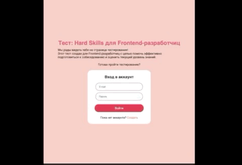
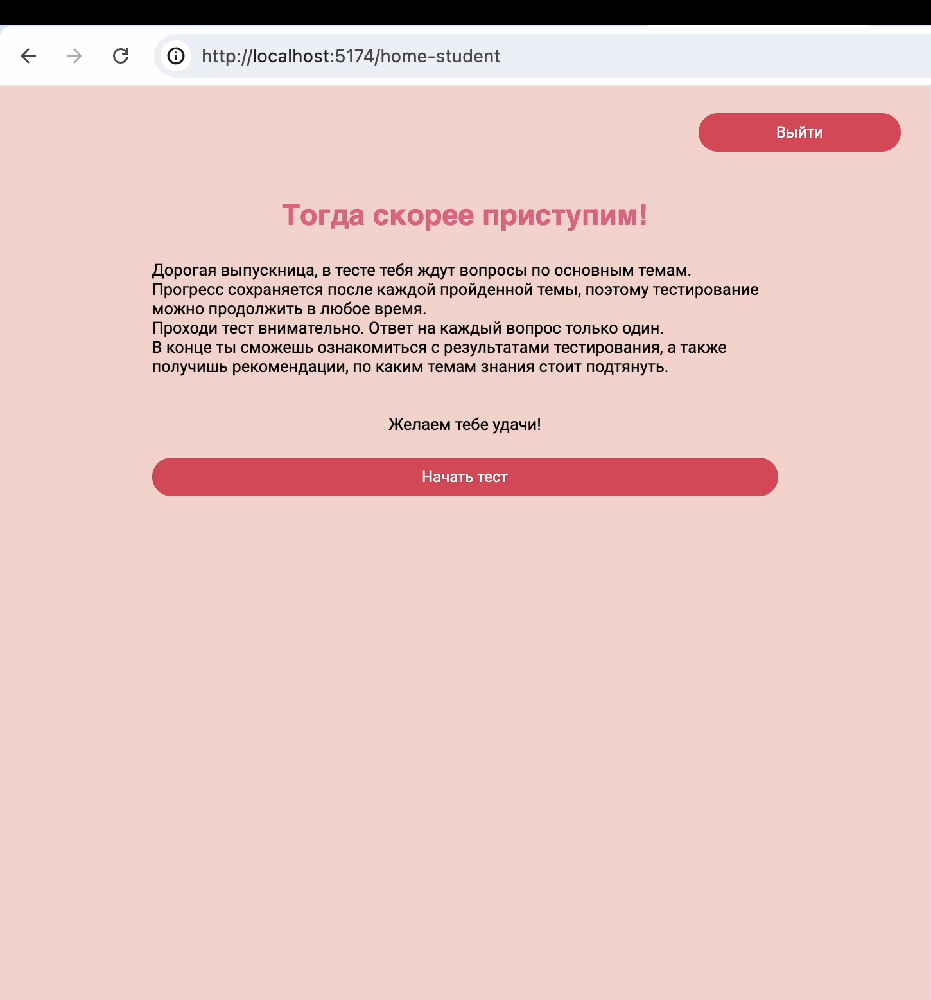
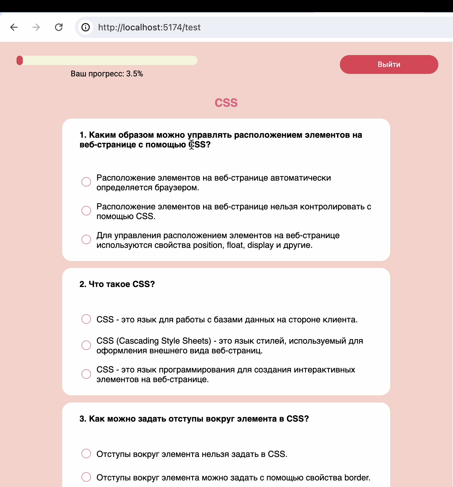
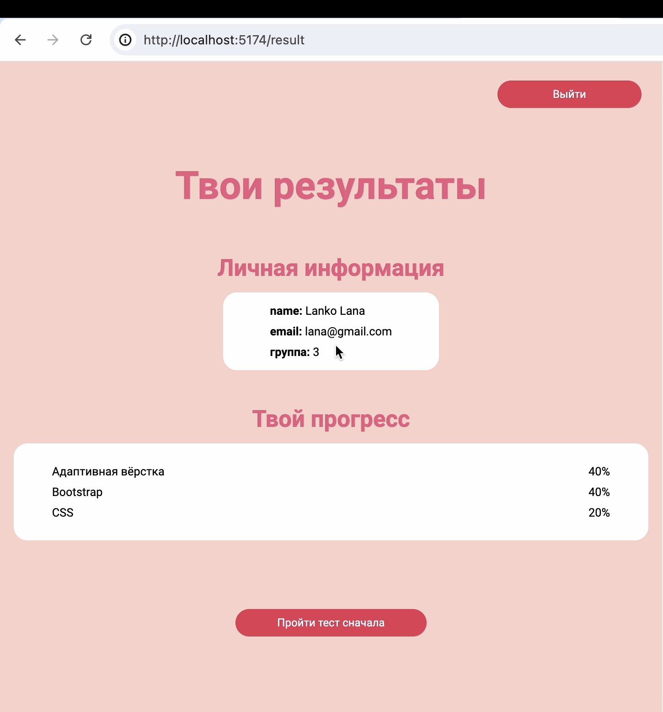
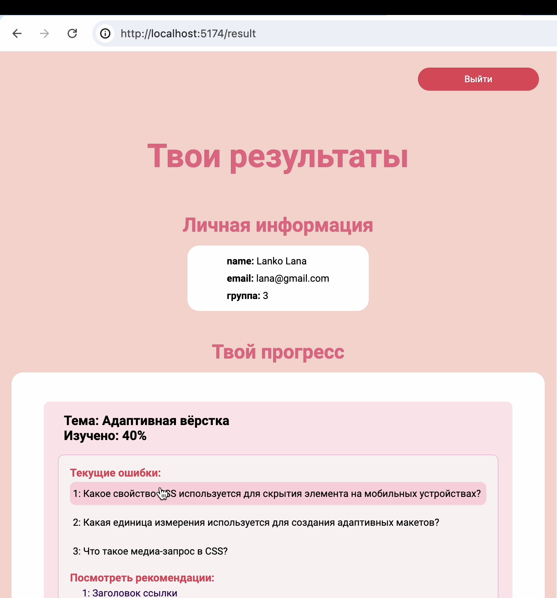
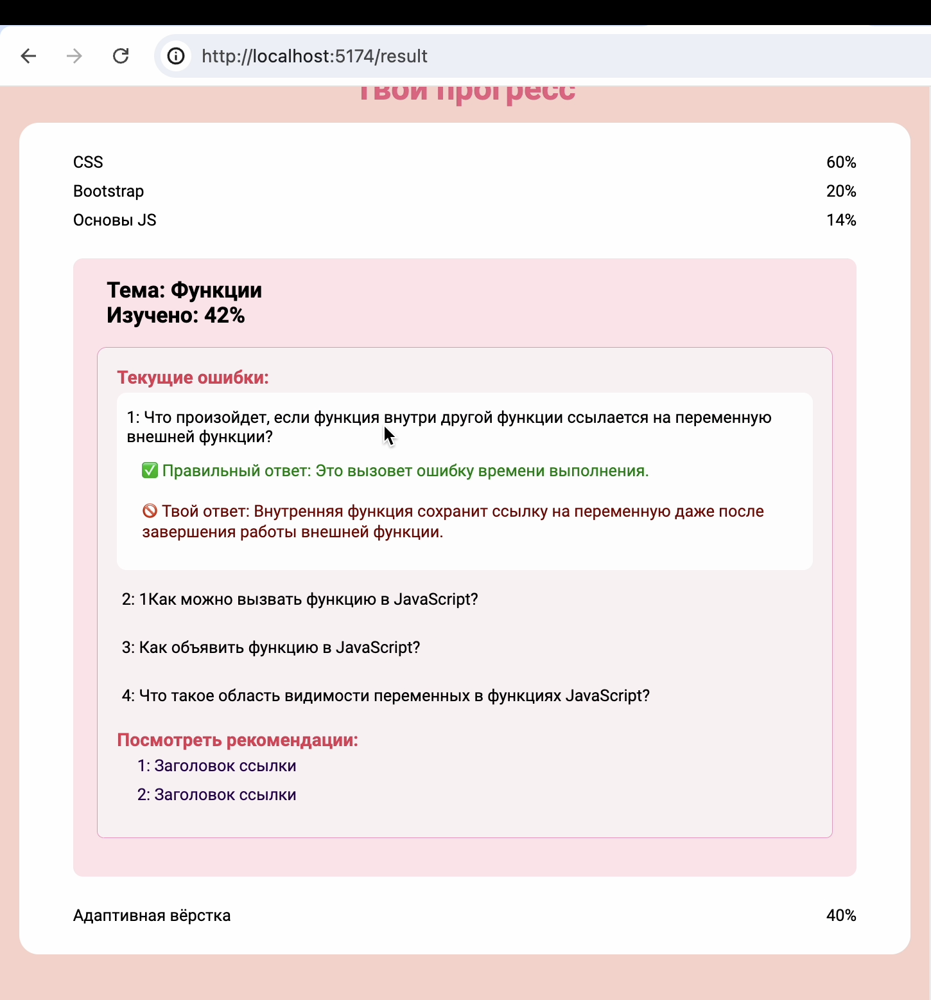

# Тестирование навыков

#### Данное приложение находится в разработке, поэтому демо-версия пока что недоступна.
 

---

## О приложении

Веб-приложение позволяет произвести диагностику (срез) знаний слушателей в области фронтенда. Результаты выдаются в виде тем с правильными и неправильными ответами, а также материалы для изучения.

 
 

## Мой вклад

Я разработала страничку с результатами. В нее входит следующий функционал:

- отрисовка пройденных тем
- вычисление прогресса прохождения (в %)
- доступ к подробной информации по теме (вопрос, ответы, доп материалы)
- обработка ошибок при взаимодействии с сервером
- сброс всех результатов по кнопке (с доп подтверждением в виде модульного окна) и перенаправление на тестирование

 
 

